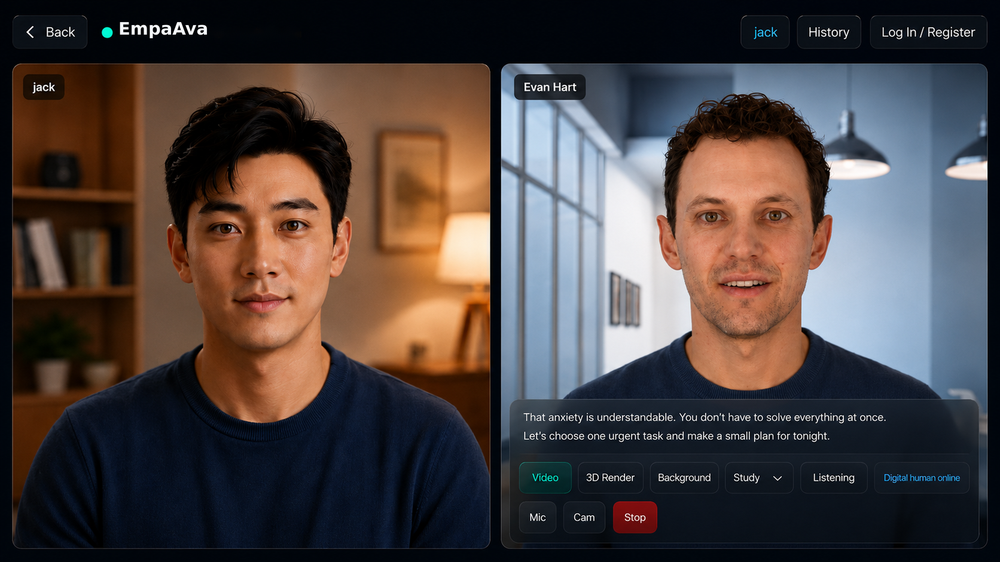
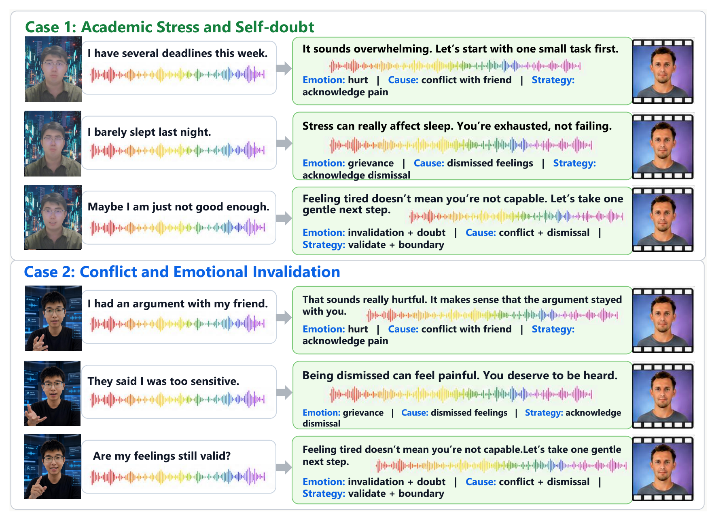
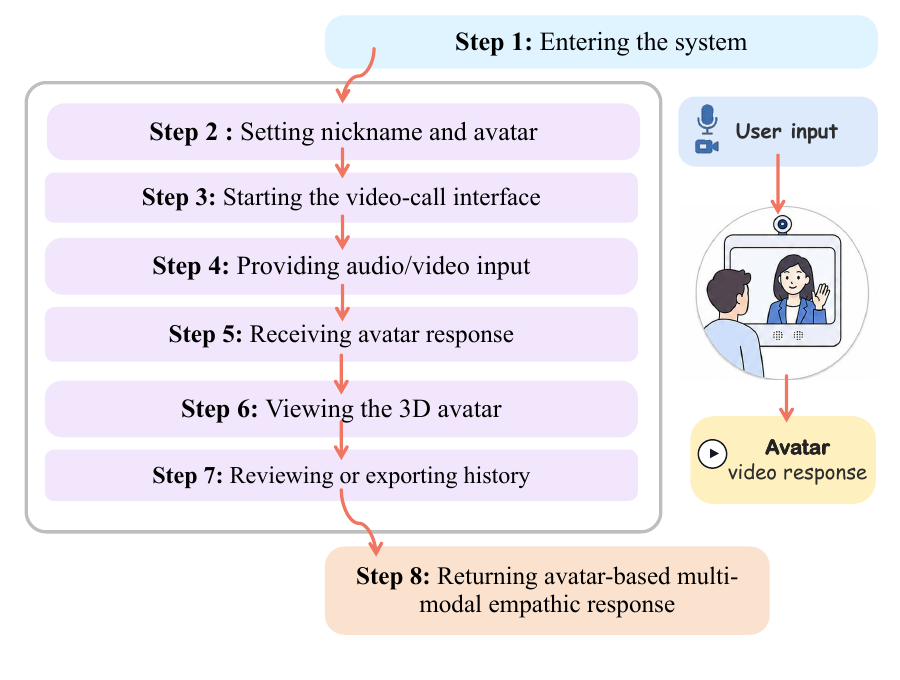
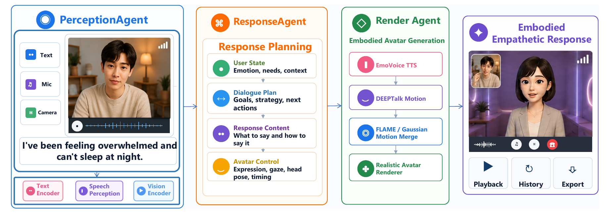

<div align="center">

# EmpaAva

### An Open-source Agentic 3D-Avatar Empathetic Live Chatbot

[](#quick-start)
[](#quick-start)
[](#architecture)
[](#license)

</div>

EmpaAva is an open-source, live, agentic 3D-avatar chatbot for face-to-face
empathetic interaction. It listens to a user, understands their words and
emotion, plans a supportive response, and delivers it through synchronized
emotional speech, facial motion, and photorealistic 3D-avatar rendering.

<p align="center">
  
</p>

<p align="center"><em>EmpaAva turns multimodal user input into a live, embodied empathetic response.</em></p>

## Contents

- [Highlights](#highlights)
- [News](#news)
- [Demo](#demo)
- [Workflow](#workflow)
- [Architecture](#architecture)
- [Quick Start](#quick-start)
- [Models and Runtime](#models-and-runtime)
- [Configuration and Documentation](#configuration-and-documentation)
- [Acknowledgements](#acknowledgements)
- [Citation](#citation)
- [License](#license)

## Highlights

- **Live multimodal interaction.** Browser-based microphone and optional camera
  input support a natural video-call-like conversation loop.
- **Tri-Agent Architecture.** PerceptionAgent, ResponseAgent, and RenderAgent
  separate understanding, empathetic planning, and embodied generation into
  independently testable stages.
- **Response Planning.** A structured plan aligns the reply text, emotion,
  voice, avatar, expression, motion, and background around one empathetic intent.
- **Embodied 3D responses.** Emotional TTS, audio-driven FLAME motion, and 3D
  Gaussian rendering produce synchronized avatar videos and interactive assets.
- **Inspectable and extensible.** Human-readable state, manifests, and modular
  workers make every stage replaceable and easier to reproduce or ablate.

## News

- **2026-07:** EmpaAva project page, paper, and full system implementation are
  prepared for public release.
- **2026-07:** The browser booth supports guest sessions, avatar and background
  selection, multimodal conversation history, playback, and export.
- **2026-07:** The complete perception-to-rendering pipeline is available through
  a unified CLI and local worker services.

## Demo

EmpaAva runs as a video-call-like emotional booth. A user selects a digital
human, speaks naturally, and receives a rendered avatar response with emotional
speech and synchronized facial motion. Each conversation turn can be replayed,
inspected in the 3D viewer, or exported from the session history.

<p align="center">
  
</p>

<p align="center"><em>Qualitative multi-turn examples for academic stress and emotional invalidation.</em></p>

## Workflow

The browser handles entry, avatar setup, audio/video capture, response playback,
3D viewing, and conversation export as one continuous interaction.

<p align="center">
  
</p>

At runtime, each turn follows the same end-to-end path:

```text
Audio + optional video
  -> speech recognition and emotion perception
  -> empathetic response planning
  -> emotional speech synthesis
  -> audio-driven facial motion
  -> FLAME and Gaussian motion merge
  -> photorealistic 3D-avatar rendering
  -> browser playback, history, and export
```

## Architecture

<p align="center">
  
</p>

EmpaAva decomposes empathetic interaction into three cooperating agents:

1. **PerceptionAgent** converts speech, acoustic emotion, optional visual context,
   and dialogue history into a structured representation of the user state.
2. **ResponseAgent** reasons about the user's emotion, needs, and context, then
   produces a reply plan covering content, strategy, delivery, and avatar control.
3. **RenderAgent** executes the plan with emotional TTS, DEEPTalk motion,
   FLAME/Gaussian parameter merging, and realistic avatar rendering.

The agents communicate through inspectable JSON state rather than opaque model
interfaces, so perception, planning, speech, motion, and rendering components can
be tested or replaced independently. See
[Agent Architecture](docs/AGENT_ARCHITECTURE.md) for the full stage contracts.

## Quick Start

### 1. Clone the repository

```bash
git clone https://github.com/1114531938/EmpaAva_System.git
cd EmpaAva_System
```

The full system depends on local model checkpoints, integration environments,
and runtime assets. Complete the machine setup described in
[Reproduction Setup](docs/REPRODUCTION_SETUP.md) before launching all workers.

### 2. Start an interface

```bash
# Main studio UI
bash scripts/avatar.sh web

# EmpaAva booth UI; local workers start automatically by default
bash scripts/avatar.sh booth
```

Then open:

- Studio: <http://localhost:7861/>
- EmpaAva booth: <http://localhost:7862/>

Use `DEPB_AUTO_START_WORKERS=0` to manage workers separately:

```bash
bash scripts/avatar.sh worker perception
bash scripts/avatar.sh worker avamerg
bash scripts/avatar.sh worker tts
bash scripts/avatar.sh worker deeptalk
bash scripts/avatar.sh worker gaussian
```

### 3. Run the agent pipeline directly

```bash
PYTHONPATH=src python -m avatar_system.pipeline.cli \
  --input_wav /path/to/input.wav \
  --input_video /path/to/optional_user_video.webm \
  --avatar_id 306 \
  --tts_speaker_id 6224 \
  --background study \
  --config src/avatar_system/pipeline_config.yaml
```

Outputs are written to `runtime/outputs/<run_id>/`, including stage state,
perception results, the reply plan, generated audio and motion, viewer assets,
and the final avatar video.

## Models and Runtime

EmpaAva connects specialized open-source models through local workers instead of
treating the system as one end-to-end model.

| Stage | Default model or tool | Main output |
| --- | --- | --- |
| Speech recognition | Whisper (`small` by default) | Transcript and ASR metadata |
| Speech emotion recognition | FunASR `emotion2vec_plus_seed` | Normalized acoustic emotion |
| Empathetic reasoning | AvaMERG / configured LLM backend | Reply content and response plan |
| Emotional speech | EmotiVoice | Synthesized response WAV |
| Facial motion | DEEPTalk | Frame-level FLAME motion |
| Motion integration | FLAME / Gaussian parameter merge | Render-ready motion sequence |
| Avatar generation | GaussianAvatar renderer | MP4 and interactive viewer assets |

Default local service ports are:

| Port | Service |
| ---: | --- |
| 7861 | Main FastAPI studio |
| 7862 | EmpaAva booth |
| 8788 | EmotiVoice worker |
| 8789 | AvaMERG worker |
| 8790 | DEEPTalk worker |
| 8791 | Perception worker |
| 8792 | Gaussian render worker |

For health checks, worker contracts, and port overrides, see
[Services and Ports](docs/SERVICES_AND_PORTS.md).

## Configuration and Documentation

The main pipeline configuration is
[`src/avatar_system/pipeline_config.yaml`](src/avatar_system/pipeline_config.yaml).
Environment overrides and runtime path examples are documented in
[`config/runtime.env.example`](config/runtime.env.example).

| Guide | Purpose |
| --- | --- |
| [Project Structure](docs/PROJECT_STRUCTURE.md) | Repository layout and component ownership |
| [Agent Architecture](docs/AGENT_ARCHITECTURE.md) | Agent responsibilities, state, and stage contracts |
| [Reproduction Setup](docs/REPRODUCTION_SETUP.md) | Environments, checkpoints, assets, and host setup |
| [Services and Ports](docs/SERVICES_AND_PORTS.md) | Worker processes, URLs, and health checks |
| [Aliyun Deployment](docs/DEPLOY_ALIYUN.md) | Server deployment and operational notes |

Runtime caches, checkpoints, containers, virtual environments, and generated
outputs belong under `runtime/` or integration-specific ignored directories and
should not be committed.

## Acknowledgements

EmpaAva is built on the contributions of the open-source research community. We
thank the authors and maintainers of
[AvaMERG](https://github.com/WalkerMitty/AvaMERG),
[EmotiVoice](https://github.com/netease-youdao/EmotiVoice),
[DEEPTalk](https://github.com/whwjdqls/DEEPTalk),
[GaussianAvatars](https://github.com/ShenhanQian/GaussianAvatars),
[VHAP](https://github.com/ShenhanQian/VHAP),
[Whisper](https://github.com/openai/whisper),
[FunASR](https://github.com/modelscope/FunASR), FLAME, FastAPI, and ffmpeg.
Please also cite the upstream models and datasets used in your experiments.

## Citation

If you find EmpaAva useful in your research, please cite:

```bibtex
@misc{yang2026empaava,
  title        = {EmpaAva: An Open-source Agentic 3D-Avatar Empathetic Live Chatbot},
  author       = {Yang, Jie and Xu, Wenhao and Lin, Shuhui and Fei, Hao},
  year         = {2026},
  howpublished = {\url{https://github.com/1114531938/EmpaAva_System}}
}
```

## License

This repository combines multiple research components. Check the license and
usage terms of every integrated model, checkpoint, dataset, voice, and avatar
asset before redistribution or commercial use. Some dependencies are restricted
to research or non-commercial use.
